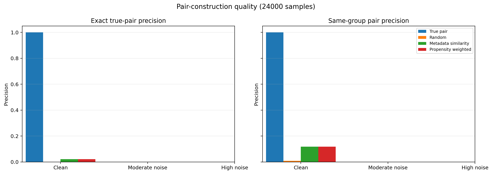
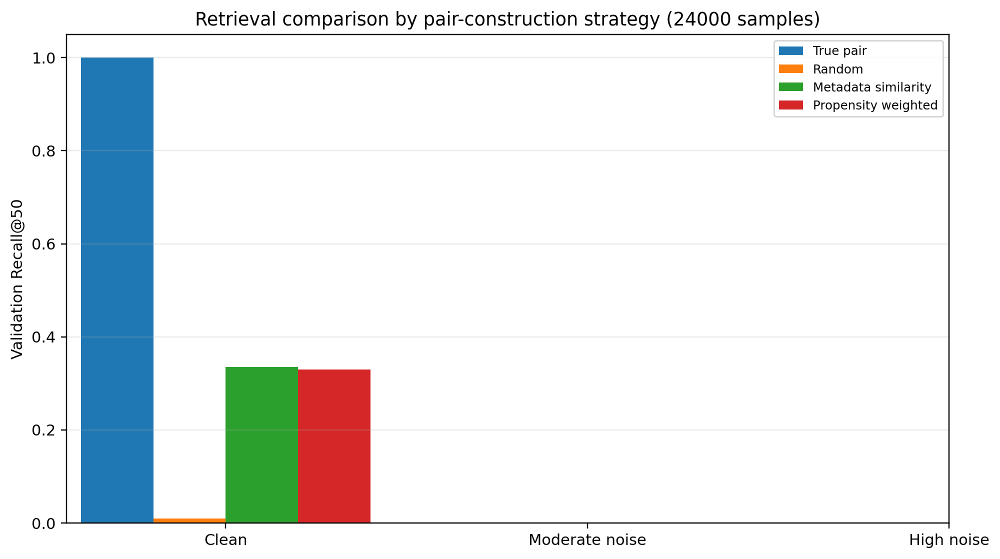
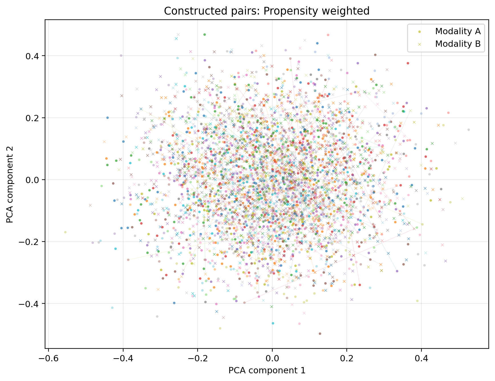

# Propensity Matching for Multimodal Pairs

A controlled benchmark for studying how pseudo-pair construction affects multimodal retrieval.

This repository focuses on the pairing step: before training a retrieval model, how should samples from two modalities be matched when true pairs are unavailable, noisy, or only approximately recoverable?

The project compares random pairing, metadata-similarity pairing, and propensity-weighted pairing against a true-pair upper bound.

## Research Report

A paper-style summary of this project is available here:

[Read the paper-style report](docs/paper_style_report.md)

---

## Why Pair Construction Matters

In multimodal contrastive learning, the model learns from paired examples.

If the pair assignments are reliable, the model can learn meaningful cross-modal alignment. If the pair assignments are weak or noisy, the model may learn the wrong structure, even if the encoder and loss function are reasonable.

This repository treats pair construction as a first-class part of the retrieval pipeline.

The central idea is:

> Before asking whether the model is good, ask whether the training pairs are meaningful.

---

## Core Question

> Can metadata-based pseudo-pair construction recover useful retrieval signal when exact cross-modal pairs are unavailable or difficult to identify?

The benchmark tests this by changing:

- metadata reliability
- feature noise
- sample size
- pairing strategy
- exact-pair and same-group pair precision

---

## Pairing Strategies

This benchmark compares true-pair supervision, random pairing, metadata-similarity pairing, and propensity-weighted pseudo-pairing.

The goal is to test whether pseudo-pairing methods can move above random pairing and closer to the true-pair upper bound.

For the detailed method description, see the [paper-style report](docs/paper_style_report.md#3-method).

---

## Synthetic Benchmark

The benchmark uses controlled synthetic multimodal data with:

| Component | Description |
|---|---|
| Modality A | Synthetic feature vector |
| Modality B | Synthetic feature vector |
| Metadata | Age, severity score, binary conditions, sex |
| Group label | Latent group used to measure approximate semantic matching |
| True pair ID | Known exact cross-modal pair |

Three data conditions are tested:

| Condition | Meaning |
|---|---|
| Clean | Metadata and modality features are relatively aligned |
| Moderate noise | Metadata and features become less reliable |
| High noise | Metadata becomes weak and pair ambiguity becomes severe |

Two sample sizes are used:

| Total samples | Held-out retrieval pool |
|---:|---:|
| 8000 | 1600 |
| 24000 | 4800 |

All reported runs use 50 training epochs.

---

## Related Work

This project is motivated by propensity-score matching and recent work on unpaired multimodal alignment.

For the full related-work discussion and references, see the [paper-style report](docs/paper_style_report.md#12-related-work).

---

## Experiment Matrix

```text
3 data conditions × 2 sample sizes × 4 pairing strategies = 24 runs
```

| Variable | Values |
|---|---|
| Data condition | clean, moderate noise, high noise |
| Sample size | 8000, 24000 |
| Pairing strategy | true pair, random, metadata similarity, propensity weighted |
| Training duration | 50 epochs |

---

## Metrics

This repository reports both pair quality and retrieval quality.

| Metric | Meaning |
|---|---|
| Pair true precision | Fraction of constructed pairs that are exact true pairs |
| Pair group precision | Fraction of constructed pairs from the same latent group |
| Recall@K | Whether the correct match appears in the top K retrieved candidates |
| Lift@K | Retrieval improvement over random chance |
| Positive-pair similarity | Cosine similarity of true pairs in the learned embedding space |
| Training loss | Contrastive optimization loss |

This separation matters because retrieval results can be misleading if pair quality is not reported.

---

## Pair-Construction Visualizations

The plots below summarize pair quality, retrieval performance, and the constructed pseudo-pair space.

<table>
  <tr>
    <th>Pair quality</th>
    <th>Retrieval comparison</th>
    <th>Propensity pairing space</th>
  </tr>
  <tr>
    <td width="33%">
      <a href="figures/pair_quality_comparison.png">
        
      </a>
    </td>
    <td width="33%">
      <a href="figures/retrieval_strategy_comparison.png">
        
      </a>
    </td>
    <td width="33%">
      <a href="figures/propensity_pairing_space.png">
        
      </a>
    </td>
  </tr>
</table>

Each panel links to the full-resolution figure.

| Panel | What to notice |
|---|---|
| **Pair quality** | True-pair supervision is the oracle upper bound, random pairing is the lower bound, and metadata/propensity methods recover partial group-level pairing signal. |
| **Retrieval comparison** | Retrieval performance follows pair quality: true pairs perform best, random pairs perform worst, and pseudo-pairing methods sit between them. |
| **Propensity pairing space** | Circles and crosses represent the two modalities. Lines show selected propensity-weighted constructed pairs. Shorter and more local lines suggest more geometrically plausible pseudo-pairs. |

These figures are qualitative diagnostics. The main conclusions are based on the quantitative results in `experiments/results_table.csv`.

## Results

The full benchmark results are available here:

- [Full benchmark summary](experiments/results_summary.md)
- [Raw result table](experiments/results_table.csv)

The summary file includes the complete 24-run comparison across clean, moderate-noise, and high-noise conditions.

---

## Main Findings

- True-pair supervision gives the strongest retrieval performance and acts as an oracle upper bound.
- Random pairing behaves like a lower bound and does not provide useful alignment signal.
- Metadata similarity can recover useful signal when metadata is informative.
- Propensity-weighted matching can improve over raw metadata similarity in harder settings.
- Under high noise, pseudo-pairing methods approach the random baseline, showing a clear failure boundary.

For the full key findings and interpretation, see the [paper-style report](docs/paper_style_report.md#8-key-findings).

---

## Repository Structure

```text
propensity-matching-multimodal-pairs/
│
├── src/
│   ├── make_demo_data.py
│   ├── build_pairs.py
│   ├── model.py
│   ├── metrics.py
│   ├── train.py
│   └── collect_results.py
│
├── data_demo/
│   ├── modality_a.csv
│   ├── modality_b.csv
│   ├── true_pairs.csv
│   └── demo_metadata.json
│
├── experiments/
│   ├── results_table.csv
│   └── results_summary.md
│
├── docs/
│
├── requirements.txt
└── README.md
```

---

## Quick Start

Install dependencies:

```powershell
pip install -r requirements.txt
```

Generate synthetic multimodal data:

```powershell
python src/make_demo_data.py --mode moderate_noise --n-samples 8000 --n-groups 80
```

Build pseudo-pairs with metadata similarity:

```powershell
python src/build_pairs.py --strategy metadata_similarity --out-csv data_demo/pairs_metadata.csv
```

Build pseudo-pairs with propensity weighting:

```powershell
python src/build_pairs.py --strategy propensity_weighted --out-csv data_demo/pairs_propensity.csv
```

Train using one pair file:

```powershell
python src/train.py --pairs-csv data_demo/pairs_propensity.csv --epochs 50 --batch-size 512 --output-dir outputs/example_propensity --checkpoint-dir checkpoints/example_propensity
```

Collect result tables:

```powershell
python src/collect_results.py
```

Generated folders such as `outputs/` and `checkpoints/` are intentionally ignored by Git.

---

## Interpretation Guide

Use the strategies as reference points:

| Strategy | How to interpret it |
|---|---|
| True pair | Best-case learning when supervision is correct |
| Random | Failure baseline |
| Metadata similarity | Simple metadata-based pseudo-pairing |
| Propensity weighted | Learned metadata-based pseudo-pairing |

A useful pseudo-pairing method should do better than random and move closer to the true-pair upper bound.

---

## Boundary of This Benchmark

This benchmark is a controlled pairing laboratory. The synthetic setup makes it possible to observe exact pair quality, same-group quality, metadata noise, and retrieval behavior under known conditions.

The results should not be read as a universal ranking of matching algorithms. They show how these specific pair-construction strategies behave inside a designed stress test.

A natural next step would be to test stronger matching estimators, add confidence-thresholded pair filtering, repeat runs across multiple seeds, and evaluate whether the same pair-quality patterns appear in authorized real paired datasets.

## Documentation

- [Pair quality audit](docs/pair_quality_audit.md)
- [Matching strategy notes](docs/matching_strategy_notes.md)
- [Metric interpretation](docs/metric_interpretation.md)
- [Reproducibility protocol](docs/reproducibility_protocol.md)

---

## References

References are included in the [paper-style report](docs/paper_style_report.md).

